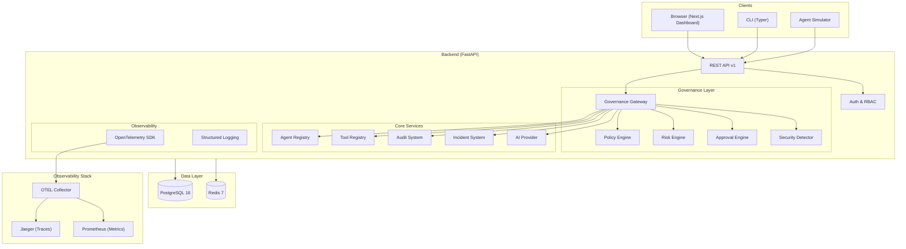
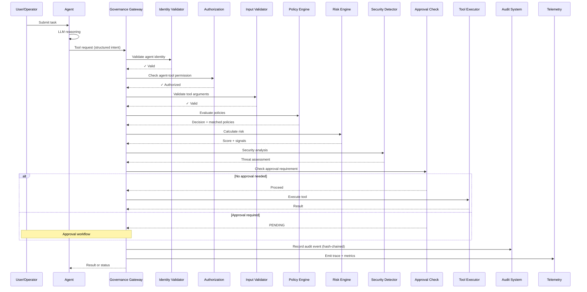
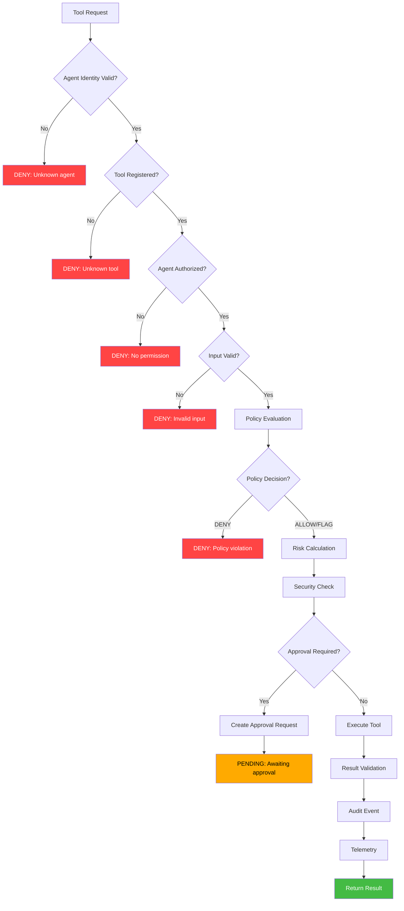
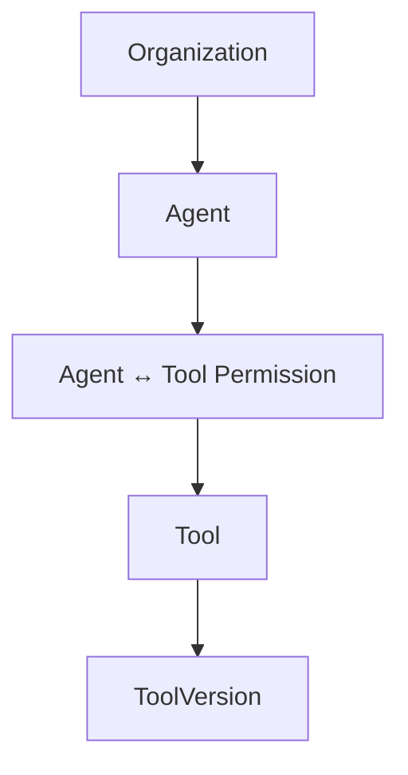
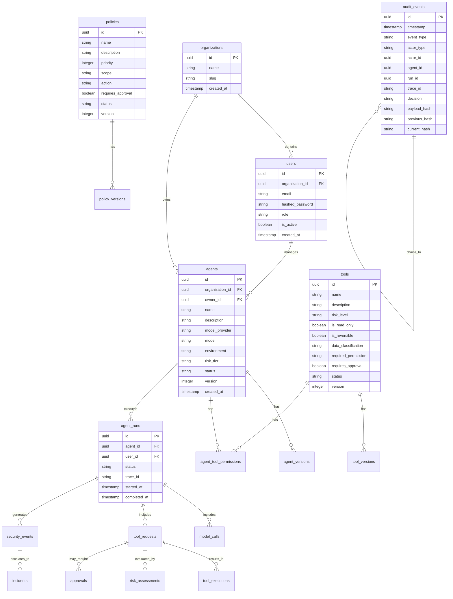
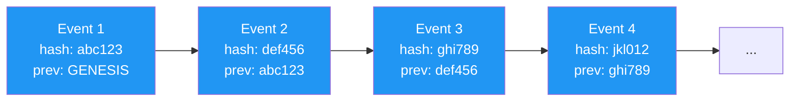
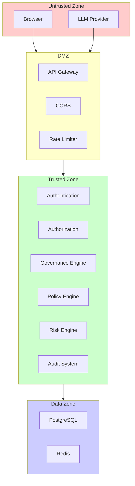

# VERIDEX — Architecture

## High-Level Architecture



## Agent Execution Lifecycle



## Governance Gateway Pipeline



## Agent to Tool Architecture




## Database ERD (Core)



## Audit Hash Chain



Each event: `current_hash = SHA256(event_data + previous_hash)`

Tampering with any event breaks the chain for all subsequent events.

## Trust Boundaries



## Service Boundaries

| Service | Responsibility | Dependencies |
|---------|---------------|-------------|
| **API** | HTTP routing, request validation | Auth, all features |
| **Auth** | Authentication, token management | Database |
| **Agent Registry** | Agent CRUD, versioning | Database, Auth |
| **Tool Registry** | Tool CRUD, permissions | Database, Auth |
| **Governance Gateway** | Central control point | Policy, Risk, Approval, Security, Audit |
| **Policy Engine** | Deterministic policy evaluation | Database |
| **Risk Engine** | Risk score calculation | Database |
| **Approval Engine** | Human approval workflow | Database, Redis |
| **Audit System** | Tamper-evident event logging | Database |
| **Security Detector** | Threat detection | Database |
| **Incident System** | Security incident management | Database, Security Detector |
| **AI Provider** | LLM abstraction | External API / Mock |
| **Telemetry** | Tracing, metrics, logging | OTEL Collector |

## Data Flow

```
HTTP Request
  → CORS validation
  → Authentication (JWT)
  → Authorization (RBAC)
  → Request validation (Pydantic)
  → Business logic
  → Database operations (SQLAlchemy async)
  → Response serialization
  → Structured logging
  → Telemetry export
```
